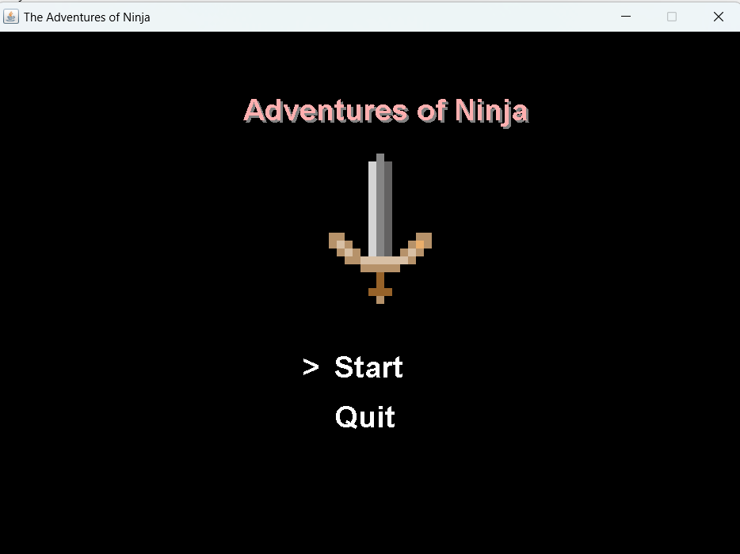
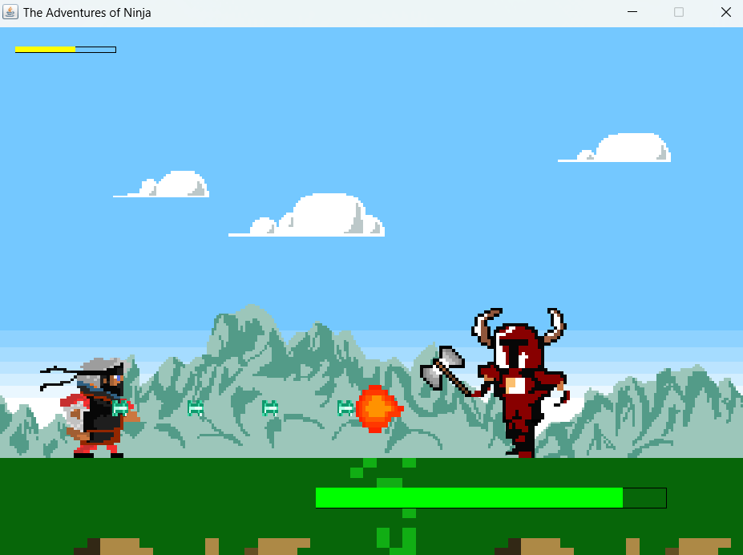
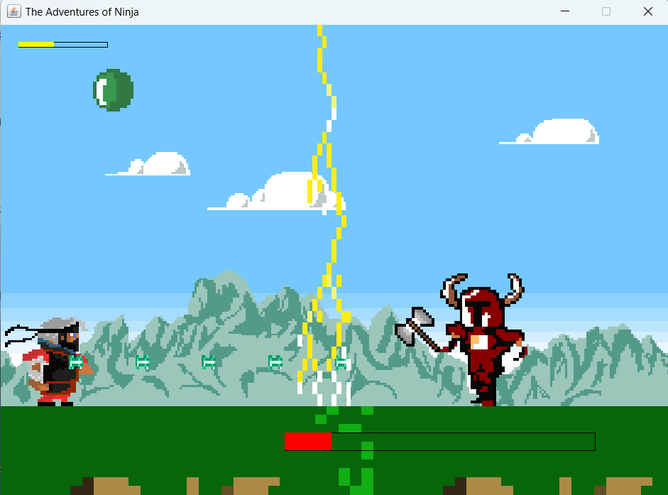

# Adventures Of Ninja
A pixel art styled, side-view shooter game developed with Java Swing.
Note: This is a school project that I did with my team, I was not the sole developer. But it was not developed using Git and GitHub at the time. This repo is simply my copy of the project.
  

In our game, we have implemented a graphical interface that represents a classic 2d- platform game. We have designed all our characters from scratch staying true to a 2D – pixel art.
The player character is able to crouch, shoot, walk sideways, and jump. Users can move the player using the A and D key and Jump with the W key and Crouch with the S key.
The player will dodge the enemy's attacks and agressive movements while cleverly trying to shoot at the boss.

